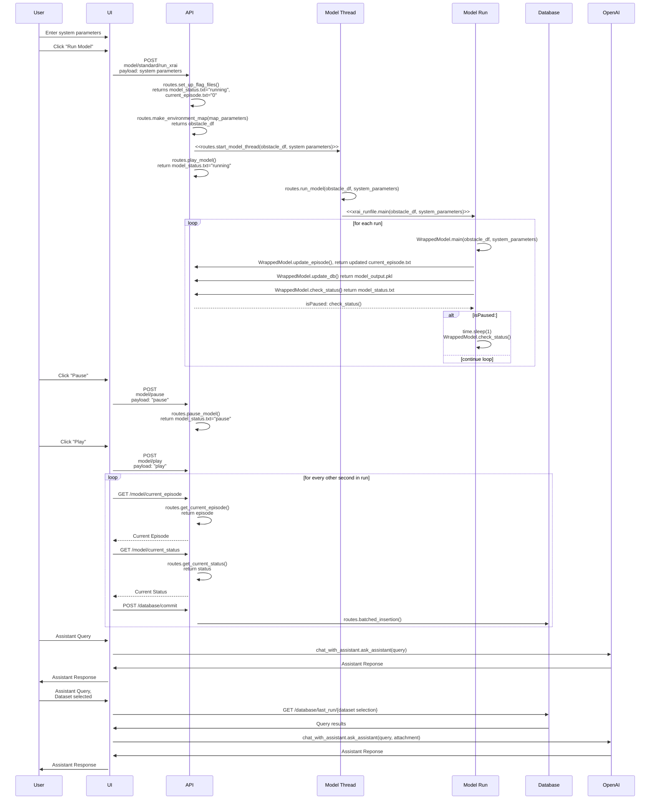

# Overview

# Contents
[Project Summary](#project-summary)

# Project Summary
## Project Description
The goal of the XRAI project was to develop a system that implements explainable AI (XAI) and responsible AI (RAI) principles on a deep reinforcement learning model that is designed to control drone swarms.

## Assumptions
This system was built around the needs of a generic drone data analyst. Given the lack of an actual drone data analyst to interview and test the system, several assumptions were made:
1.	The drone data analyst has a basic understanding of drone swarm operations. 
2.	The drone data analyst has a basic understanding of deep reinforcement learning. The system’s visualizations and data models are based on the basic components of a reinforcement learning model – environment, agents, actions, rewards, and policies – and the drone data analyst is assumed to have a basic understanding of what these components are.  

## Architecture
The XRAI System is designed to allow users to easily execute and analyze the behaviors of the DRL model, which controls a drone swarm’s movements during a mission. The XRAI System provides the following general functionalities:
- **Parameter Selection:** Users can set parameters for each mission, including environment obstacles, RAI expectations, drone swarm settings, and DRL parameters. 
- **Model Execution:** Users can execute the DRL according to their selected parameters and may pause/play at will to analyze mission progress. 
- **ChatGPT Assistant Integration:** Users can send mission-related data and queries to a ChatGPT assistant to explain the drone swarm’s behavior. 
- **Visualizations:** Users can view visualizations of the DRL’s output to further enhance their understanding of the drone swarm’s behavior. 
The system is comprised of a web-based UI and API that manages DRL execution and database operations required to store and share DRL output. 

### High-Level Architecture Diagram 

### Data Flow: User, UI, API

