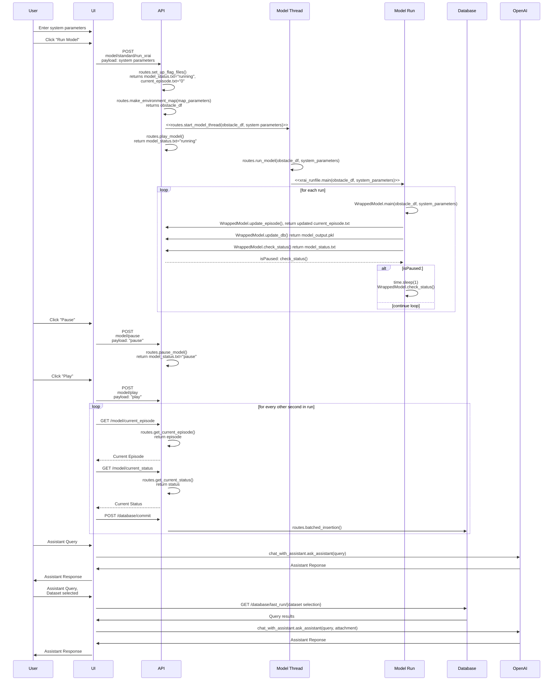

# Main Points
- This API was created as part of a project that sought to apply XAI and RAI principles to an autonomous vehicle DRL. It allows you to analyze the training of a drone swarm DRL with the option to adjust swarm parameters and responsibility constraints (i.e. don't hit obstacles)
- This API was built with Flask, and integrates 
  - a pre-existing deep reinforcement learning (DRL) model that simulates drone swarm missions,  
  - a wrapper class that applies responsibility constraints without altering the base DRL, 
  - and a PostgreSQL database designed to store data generated during model runs.
- You can run this without the [interface]((https://github.com/mklocinski/CapstoneTeamApp))
- [Arrive here from a GMU SEOR Capstone Course?](#capstone-students)

# Contents

- [Project Description](#project-description)  
    - [Background](#background)
    - [App Description](#app-description)
- [Authentication](#authentication)
- [Getting Started](#getting-started)
  - [Prerequisites](#prerequisites)
  - [How to Download](#how-to-download)
  - [How to Run](#how-to-run)
- [Endpoints](#Endpoints)
  - [Request Bodies](#request-bodies)
- [Database](#database)
- [Architecture](#architecture)
- [Contributing](#contributing)

## Project Description
This API was created as part of a GMU SEOR capstone project. The project's focus was on taking a preexisting DRL model and making its output explainable (XAI) and responsible (RAI). An app was created to demonstrate the application of XAI and RAI on a DRL that runs autonomous drone swarm missions. 

### Overview
The app allows a user to execute the DRLSS model, which can run either an autonomous rendezvous or an autonomous pursuit-evasion drone swarm mission, but with the ability to apply and test the impact of RAI constraints on drone swarm movement. The user can customize:
- the agents, by adjusting parameters like number of drones and drone physics
- the environment, by adding in obstacles 
- the reward, by specifying whether the drones need to avoid obstacles, or if they need to maintain a buffer distance around obstacles

To gain insight into the drone swarm's movement as well as the impact of RAI, a Chat-GPT Assistant that was specifically trained to answer questions about drone swarm movement was integrated into the app (this is the XAI component). The Assistant can either answer general questions about drone swarm behavior, or analyze data generated from a mission that is currently running in the app. Several interactive visualization were also included in the interface to allow the user to "follow along" as the mission executes. 

In total, the app comprises:
- an interface that allows the user to easily initiate, manage, and analyze simulated autonomous drone swarm missions (Dash) 
- a database that manages the voluminous data produced by each mission (Postgresql)
- a Chat-GPT Assistant that is trained to answer questions about general and specific drone swarm missions,
- and an API that houses the model and manages communication between the model, interface, database, and Assistant.

This repo only contains the API code. See [here](https://github.com/mklocinski/CapstoneTeamApp) for the repo containing the code for the interface.  

### Background
DRL algorithms can effectively manage autonomous fleets, enabling them to complete complex tasks in dynamic environments. However, for DRLs to be practical in real-world applications, they must adhere to responsibility norms, such as prioritizing safety (e.g., avoiding harm to people) over efficiency when conflicts arise. Further, in order for organizations to responsibly use DRLs for autonomous fleet management, they need to be able explain the behavior of their drones in order to conduct risk analyses and root cause analyses. 

This project used the Deep RL for Swarm Systems ([DRLSS](https://github.com/ALRhub/deep_rl_for_swarms/tree/master)) model to test out how RAI and XAI can be applied to an existing DRL model. The DRLSS was created by Maximilian Hüttenrauch, Adrian Šošić, and Gerhard Neumann to demonstrate the use of mean feature embeddings for state representation on a trust region policy optimization (TRPO) RL algorithm (here's the [Arxiv link](https://arxiv.org/abs/1807.06613) for their very interesting paper). The mean feature embedding approach helps overcome dimensionality issues inherent to drone swarms. Using TRPO limits the possibility of dynamic or unintuitive actions being selected, which can hinder interpretability. 

## Authentication
None, this is the code for the API. If you decide to use this along with the [interface](https://github.com/mklocinski/CapstoneTeamApp), you will need your own OpenAI Assistant and OpenAI key. See its documentation for more details.

## Getting Started
### Prerequisites
- **Git**
- **pip**
- **Docker**

### How to Download
1. Make sure Docker Desktop is running
2. Clone this repo to your local computer
3. cd to `[clone location]/CapstoneTeamAPI`
4. Set up environment variables: you'll need to set up two files, .env (should you want to deploy the API) and .env.local (to run the API locally). 
   - Copy the .env_template and .env.local_template files
```commandline
cp .env_template .env
cp .env.local_template .env.local
```
  - Next, for each environment file, enter in what port you'll use you want the database credentials to be:
**.env.local**
```commandline
# Local Development Environment Variables
FLASK_ENV=development
PORT=[INSERT]

# Local Database Credentials
POSTGRES_USER=[INSERT]
POSTGRES_PASSWORD=[INSERT]
POSTGRES_DB=[INSERT]

# Only worry about this if you decide to deploy to Heroku
# SQLALCHEMY_DATABASE_URI=[INSERT]
```
**.env**
```commandline
FLASK_ENV=production
PORT=[INSERT]
POSTGRES_USER=[INSERT]
POSTGRES_PASSWORD=[INSERT]
POSTGRES_DB=[INSERT]

# Only worry about this if you decide to deploy to Heroku
# SQLALCHEMY_DATABASE_URI=[INSERT]
```
5. Run the Docker container
```commandline
docker-compose up
```
6. You can access the API at whatever port you specified:
```commandline
http://localhost:[port you specified in the .env.local file]
```

### Quick Start
If using this API with the app interface, please refer to its [Getting Started](https://github.com/mklocinski/CapstoneTeamApp)
This guide assumes you are running the API locally, and using a Python editor to interact with the API and its database.

#### Run a drone mission
```python
import requests
import pandas as pd

params = {"nr_agents": 7,
          "timesteps_per_batch": 20,
          'buildings': {'count': 14, 'damage': 5, 'sizes': [2], 'random': 1, 'positions': ['None set']},
          'avoid_collisions': True
          }

url = "https://localhost:[your-port]/database/last_n_runs/tbl_model_run_params"
run = requests.post(url, params=params)

# to monitor progress, you can periodically run "https://localhost:[your-port]/model/current_episode
```

#### Analyze data from previous missions/model runs
```python
# Last n runs to review
params = {"n": 3} # 

# Get run parameter data for last n runs
url = "https://localhost:[your-port]/database/last_n_runs/tbl_model_run_params"
model_param_data_json = requests.get(url, params=params)
model_param_data = model_param_data_json.json() 
model_param_data = pd.DataFrame(model_param_data)
model_param_data = model_param_data[["cflt_run_id", "cint_nr_agents"]].drop_duplicates()

# Get local state data for last n runs
url = "https://localhost:[your-port]/database/last_n_runs/tbl_local_state"
local_data_json = requests.get(url, params=params)
local_data = local_data_json.json() 
local_data = pd.DataFrame(local_data)

# Get reward information for last n runs
url = "https://localhost:[your-port]/last_n_runs/tbl_rewards"
reward_data_json = requests.get(url, params=params)
reward_data = reward_data_json.json() 
reward_data = pd.DataFrame(reward_data)
```

## Endpoints
| Endpoint                 | Method | Description                                                                                                       | Example Request Body |
|--------------------------|--------|-------------------------------------------------------------------------------------------------------------------|----------------------|
| `/model/standard/run_xrai` | POST   | Runs a drone mission (model run) with parameters entered through the interface. **Requires an interface**         | See below            |
| `/model/no_app/run_xrai` | POST   | Runs a drone mission (model run) with user-specified parameters. See below for list of parameters                 | See below            |
| `/model/pause`           | GET    | Pauses the mission.                                                                                               | None                 |
| `/model/play`            | GET    | Plays the mission (used to restart the mission after a pause).                                                    | None                 |
| `/model/stop`            | GET    | Ends the mission.                                                                                                 | None                 |
| `/model/current_episode` | GET    | Returns the current timestep.                                                                                     | None                 |
| `/model/status`          | GET    | Returns the current status ("running", "paused", "complete").                                                     | None                 |
| `/database/commit`       | GET    | Collects the data that has been incrementally saved over each timestep and commits it to the database.            | None                 |
| `/database/last_run/tbl_model_runs` | GET    | Returns data from tbl_model_runs for the most recent model run. Click here for [database](#Database) information. | None                 |
| `database/last_run/tbl_local_state` | GET    | Returns data from tbl_local for the most recent model run. Click here for [database](#Database) information.                   | None                 |
| `/database/last_run/tbl_rewards` | GET    | Returns data from tbl_rewards for the most recent model run. Click here for [database](#Database) information.                 | None                 |
| `/database/last_run/tbl_rai` | GET    | Returns data from tbl_rai for the most recent model run. Click here for [database](#Database) information.                     | None                 |
| `/database/last_run/tbl_global_state` | GET    | Returns data from tbl_global_state for the most recent model run. Click here for [database](#Database) information.            | None                 |
| `/database/last_run/tbl_drone_actions` | GET    | Returns data from tbl_drone_actions for the most recent model run. Click here for [database](#Database) information.           | None                 |
| `/database/last_run/tbl_model_run_params` | GET    | Returns data from tbl_model_run_params for the most recent model run. Click here for [database](#Database) information.        | None                 |
| `database/last_run/tbl_map_data` | GET    | Returns data from tbl_map_data for the most recent model run. Click here for [database](#Database) information.                | None                 |
| `/api/get_run_id` | GET    | Returns the current (or most recent) model run's ID.                                                              | None                 |
| `/database/last_n_runs/<string:table_name>` | GET    | Returns information from the entered table for the last n missions (model runs).                                  | None                 |

### Request Bodies
Only two endpoints, `/model/standard/run_xrai` and `/model/no_app/run_xrai`, require request bodies.
- `/model/standard/run_xrai` is used by the interface, and receives the user parameters entered into the interface.
- `/model/no_app/run_xrai` is designed for non-interface use. A user can run the API from a Python editor and enter their parameters into dictionaries.

A complete list of user parameters, along with their definitions and valid values, can be viewed [here](https://github.com/mklocinski/CapstoneTeamApp/blob/main/assets/XRAI%20System%20-%20User%20Parameters.xlsx). 

**Environment Parameters**
```python
{"environment_id": "Rendezvous",
    "nr_agents": 20,
    "obs_mode": "sum_obs_acc",
    "comm_radius": 2,
    "world_size": 100,
    "distance_bins": 8,
    "bearing_bins": 8,
    "torus": False,
    "dynamics": "unicycle_acc"}
```
**Model Parameters**
```python
{'timesteps_per_batch': 10,
    'max_kl': 0.02,
    'cg_iters': 10,
    'cg_damping': 0.1,
    'gamma': 0.95,
    'lam': 0.95,
    'vf_iters': 5,
    'vf_stepsize': 0.001},
```
**Obstacle Parameters**
```python
{'target': {'target_x_coordinate': 20, 'target_y_coordinate': 20},
    'humans': {'count': 1, 'damage': 10, 'sizes': [3], 'random': 1, 'positions': ['None set']},
    'no_fly_zones': {'count': 1, 'damage': 10, 'sizes': [3], 'random': 1, 'positions': ['None set']},
    'buildings': {'count': 1, 'damage': 10, 'sizes': [3], 'random': 1, 'positions': ['None set']},
    'trees': {'count': 1, 'damage': 10, 'sizes': [3], 'random': 1, 'positions': ['None set']},
    'animals': {'count': 1, 'damage': 10, 'sizes': [3], 'random': 1, 'positions': ['None set']},
    'fires': {'count': 1, 'damage': 10, 'sizes': [3], 'random': 1, 'positions': ['None set']}}
```
**RAI Parameters**
```python
{'expected_completion_time': 10,
    'swarm_damage_tolerance': 10,
    'individual_drone_damage_tolerance': 10,
    'avoid_collisions': False,
    'avoid_buffer_zones': False,
    'buffer_zone_size': False,
    'collision_penalty': 10,
    'buffer_entry_penalty': 10}
```

## Database
A full data dictionary can be found [here](https://github.com/mklocinski/CapstoneTeamApp/blob/main/assets/DRL%20Data%20Dictionary.xlsx). 

|Table Name     | Description                                                                                                                        |
|---------------|------------------------------------------------------------------------------------------------------------------------------------|
|tbl_model_runs| Record of each model run (mission), including run date, and the times at which the model was started, paused, played, and stopped. |
|tbl_model_run_params| Record of all the parameter values for the DRLSS model                                                                             |
|tbl_local_state| Contains state information, such as coordinates, velocity, and collisions, on each drone for each timestep.                        |
|tbl_global_state| Contains the state encoding for each timestep.                                                                                     |
|tbl_drone_actions| Contains the specific action (linear velocity, angular velocity) taken by each drone at each timestep.                             |
|tbl_rewards| Contains all data used to calculate reward, including interdrone distance, total collision damage, etc.                            |
|tbl_map_data| Contains the information on obstacles, including positions, types, and dimensions.                                                 |
|tbl_rai| Contains the RAI parameter data for each model run (mission).                                                                      |

## Architecture
### High-Level Architecture Diagram 

```mermaid
flowchart BT
    subgraph user
          User["User"]
    end
    subgraph API
            subgraph app
                init["/__init__.py"]
                config["/config.py"]
                datamodel["/data_model.py"]
                routes["/routes.py"]
            end
            subgraph models["/models.py"]
                runfile["/XRAI_Runfile.py"]
                runmodel["/XRAI_Model.py"]
                runenv["/XRAI_Environment.py"]
                runoutput["/XRAI_Output.py"]
                obstacle["/ObstacleGenerator.py"]
                checkpoint["/CheckpointWrapper.py"]
                DRLSS["/DRLSS Model"]
            end
            subgraph migrations["Database"]
            end
        end
    subgraph UI
            subgraph pages["/pages"]
            main["/main.py"]
            data["/data.py"]
            about["/about.py"]
            end
            subgraph components["/components"]
                navbar["/navbar.py"]
                chat["/chat_with_assistant.py"]
                cside["/collapsible_sidebar.py"]
                viewer["/viewer.py"]
                subgraph visuals["/visuals"]
                    swarmview["/swarm_movements.py"]
                    drone_traj["/drone_trajectories.py"]
                    drone_health["/drone_health.py"]
                    reward["/rewards.py"]
                end
                subgraph parameters["/parameters"]
                    map["/map.py"]
                    rai["/rai.py"]
                    environment["/environment.py"]
                    model["/model.py"]
                    model["/chat.py"]
                end
            end
        end
    subgraph OpenAI
        LLM["ChatGPT Assistant"]
    end
user<-->main
chat-->main
chat-->LLM
cside-->main
cside-->LLM
swarmview-->viewer
reward-->viewer
drone_health-->viewer
drone_traj-->viewer
map<-->cside
rai<-->cside
environment<-->cside
model<-->cside
chat<-->cside
cside-->routes
datamodel-->migrations
runfile-->runmodel
runmodel-->migrations
obstacle<-->runfile
runoutput-->runmodel
runenv-->runmodel
DRLSS-->runenv
```



### Sequence Diagram

## Contributing
This repo will not be actively maintained, but you can reach out to me if you have any questions. 

### Capstone Students
Here are some functionalities that weren't fully addressed that would definitely improve this app:
  - For rendezvous missions, have the drones converge to a specified point (feature is technically already included but needs to be improved)
  - The reward function can be further improved/played with. You'll note several variables that were tested but ultimately not included -- they just need more experimentation!
  - A button to save and download the trained DRL 
  - Try using a service like Redis to improve asynchronous task management
