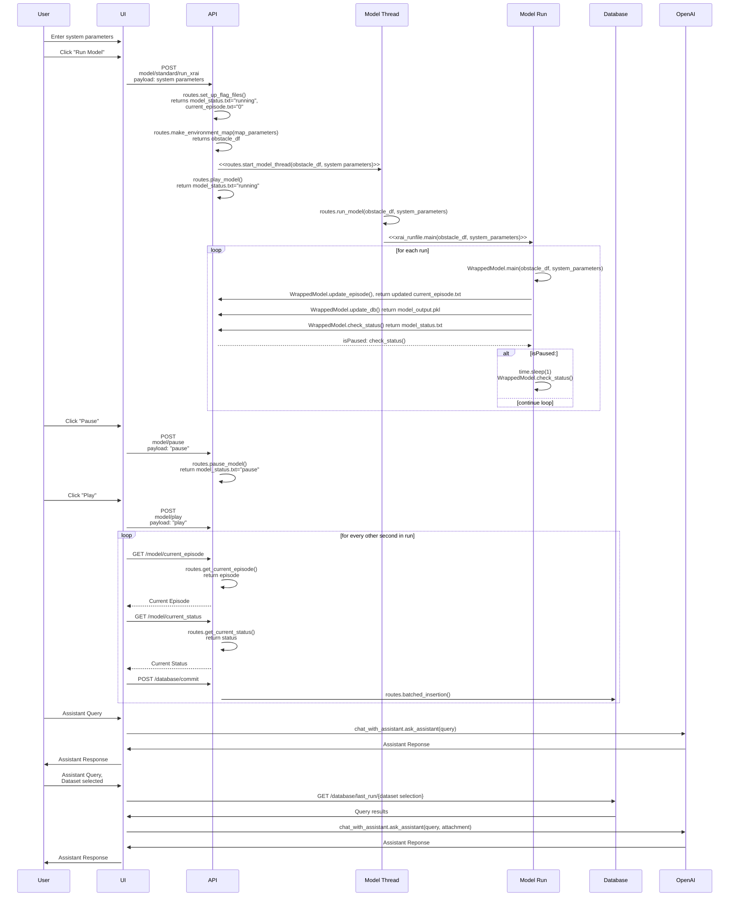

# Main Points
- This API was created as part of a project that sought to apply XAI and RAI principles to an autonomous vehicle DRL
- This API allows you to analyze the training of a drone swarm DRL with the option to adjust swarm parameters and responsibility constraints (i.e. don't hit obstacles)
- You can run this without the [interface]((https://github.com/mklocinski/CapstoneTeamApp))

## If you've arrived here from a GMU SEOR capstone course:
Here are some functionalities that weren't fully addressed:
  - For rendezvous missions, have the drones converge to a specified point (feature is technically already included but needs to be improved)
  - The reward function can be further improved/played with. You'll note several variables that were tested but ultimately not included -- they just need more experimentation!
  - A button to save and download the trained DRL 
  - Try using a service like Redis to improve asynchronous task management

# Contents

- [Project Description](#project-description)  
    - [Background](#background)
    - [App Description](#app-description)
    - [Audience](#audience)
    - [Use Cases](#use-cases)
- [Authentication](#authentication)
- [Getting Started](#getting-started)
  - [How to Download](#how-to-download)
  - [How to Run](#how-to-run)
  - [How to Deploy](#how-to-deploy)
- [Endpoints](#Endpoints)
- [Architecture](#architecture)

## Project Description
This API was created as part of a GMU SEOR capstone project. The project's focus was on taking a preexisting DRL model and making its output explainable (XAI) and responsible (RAI). An app was created to demonstrate the application of XAI and RAI on a DRL that runs autonomous drone swarm missions. 

### Background
DRL algorithms can effectively manage autonomous fleets, enabling them to complete complex tasks in dynamic environments. However, for DRLs to be practical in real-world applications, they must adhere to responsibility norms, such as prioritizing safety (e.g., avoiding harm to people) over efficiency when conflicts arise. Further, in order for organizations to responsibly use DRLs for autonomous fleet management, they need to be able explain the behavior of their drones in order to conduct risk analyses and root cause analyses. 

This project used the Deep RL for Swarm Systems ([DRLSS](https://github.com/ALRhub/deep_rl_for_swarms/tree/master)) model to test out how RAI and XAI can be applied to an existing DRL model. The DRLSS was created by Maximilian Hüttenrauch, Adrian Šošić, and Gerhard Neumann to demonstrate the use of mean feature embeddings for state representation on a trust region policy optimization (TRPO) RL algorithm (here's the [Arxiv link](https://arxiv.org/abs/1807.06613) for their very interesting paper). The mean feature embedding approach helps overcome dimensionality issues inherent to drone swarms. Using TRPO limits the possibility of dynamic or unintuitive actions being selected, which can hinder interpretability. 

### App Description
The app allows a user to execute the DRLSS model, which can run either an autonomous rendezvous or an autonomous pursuit-evasion drone swarm mission, but with the ability to apply and test the impact of RAI constraints on drone swarm movement. The user can customize:
- the agents, by adjusting parameters like number of drones and drone physics
- the environment, by adding in obstacles 
- the reward, by specifying whether the drones need to avoid obstacles, or if they need to maintain a buffer distance around obstacles

To gain insight into the drone swarm's movement as well as the impact of RAI, a Chat-GPT Assistant that was specifically trained to answer questions about drone swarm movement was integrated into the app (this is the XAI component). The Assistant can either answer general questions about drone swarm behavior, or analyze data generated from a mission that is currently running in the app. Several interactive visualization were also included in the interface to allow the user to "follow along" as the mission executes. 

In total, the app comprises:
- an interface that allows the user to easily initiate, manage, and analyze simulated autonomous drone swarm missions (Dash) 
- a database that manages the voluminous data produced by each mission (Postgresql)
- a Chat-GPT Assistant that is trained to answer questions about general and specific drone swarm missions,
- and an API that houses the model and manages communication between the model, interface, database, and Assistant.

This repo only contains the API code. See [here](https://github.com/mklocinski/CapstoneTeamApp) for the repo containing the code for the interface.  

### Audience

### Use Cases

## Authentication
None, this is the code for the API. If you decide to use this along with the [interface](https://github.com/mklocinski/CapstoneTeamApp), you will need your own OpenAI Assistant and OpenAI key. See its documentation for more details.

## Getting Started
### How to download

### How to run

### How to deploy

## Endpoints

## Architecture

### High-Level Architecture Diagram 

### Data Flow: User, UI, API

### Sequence Diagram

